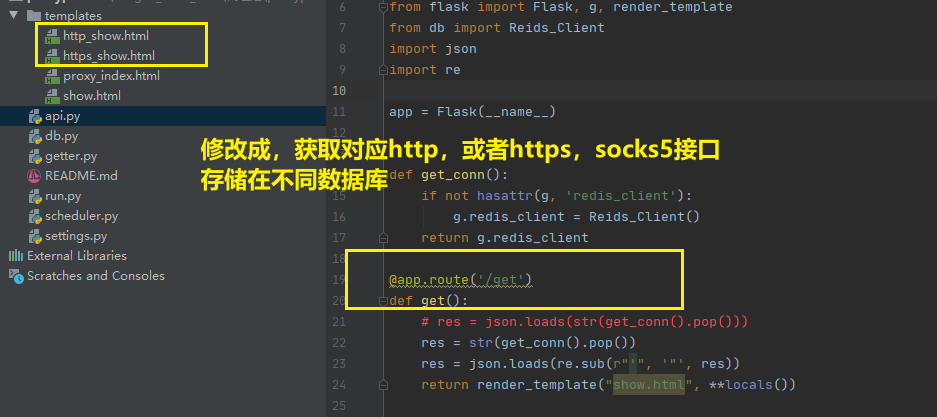
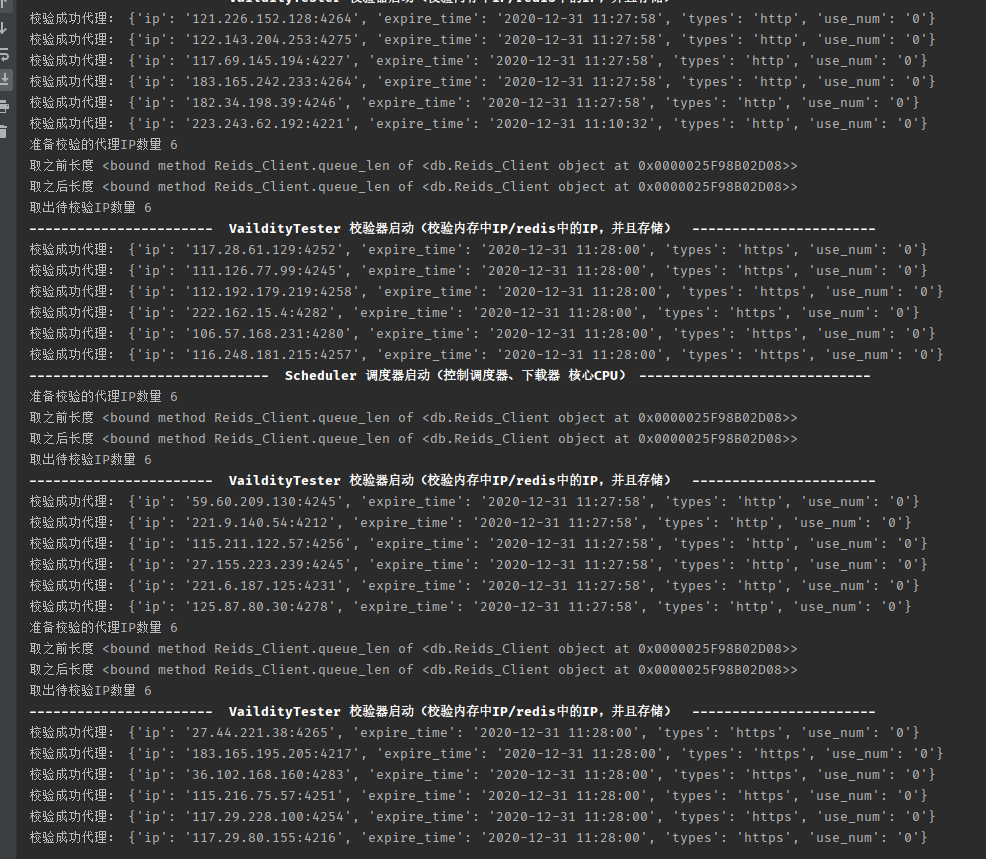
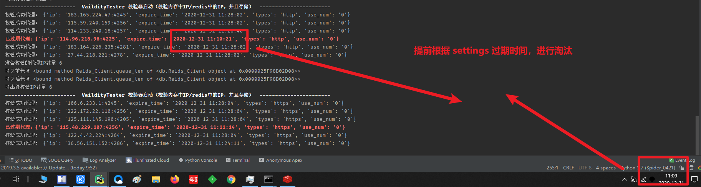

2020-12-30

存在缺陷,可以优化的地方，目前就在settings当中，只确认一个类型的获取

目标效果：
1，对爬虫程序提供一个简单的HTTP URL接口，简单调用就能获取一个可用的IP。
2，代理IP是被缓存起来的、缓存的IP数据可根据使用需求动态调节的、IP可复用的、能有效分配的。
3，可以对代理IP的消耗情况进行统计、提供方法让爬虫程序通过简单的配合后能统计出代理IP的数据产出率、代理可用率进行统计。  
4，可以设置：某一类型的爬虫程序进行每日代理IP用量限制

现阶段：
校验过期时间应该IP结束提前2分钟 （完成）
取出一个IP后，应该打上标记，使用了多少次，并且重新存回数据库 （完成）
根据IP使用次数，进行IP校验（暂时没有必要开发）(目前记录了使用次数)
评分系统，不同网站封禁后，打上不同标记

待优化：
存储在中间位置，使用过的IP

